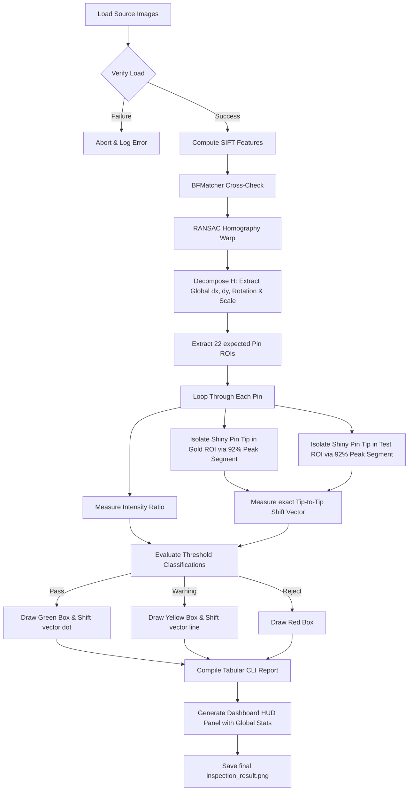

# 📘 Industrial Computer Vision Playbook: Pin Inspection Pipeline (v4.0 Final)

This document serves as a complete technical reference and playbook for building high-precision, reference-based automated quality control (QC) systems. You can use these architectural patterns, algorithms, and design choices to recreate or extend similar computer vision applications in the future.

---

## 🎯 1. Project Goals & Core Requirements
The primary objective of the system is to perform automated, top-down visual inspection of physical pin arrays or connectors to flag manufacturing defects (e.g., bent pins, missing pins, misaligned housing).

### Key Pipeline Components:
1. **Global Image Alignment & Decompositions**: Aligning a test target image to a "golden" reference image using SIFT RANSAC, and decomposing the Homography matrix to track global housing translation shift, angular tilt/rotation, and scale deviations.
2. **Sub-Pixel Pin-Tip Tracking**: Isolating specifically the shiny, topmost pin tip peak (reflection peak) inside each local ROI to detect slight physical bending with sub-pixel resolution, completely ignoring background housing artifacts.
3. **Multi-Metric Discrepancy Scoring**:
   * **Intensity Ratio**: Local gray-level intensity comparison to detect missing or hidden elements.
   * **Tip-to-Tip Centroid Shift**: Direct sub-pixel coordinate distance tracking between the golden pin tip peak and the warped test pin tip peak.
4. **Visual Dashboard (HUD)**: Color-coded visual overlay indicating system health, deviation vectors, global mounting specs, and logs.
5. **Quality Control Reporting**: Tabular terminal printout with status classifications (Pass / Warning / Reject).

---

## 🚀 2. System Architecture & Step-by-Step Flow



---

## 🛠️ 3. Implementation Code Recipes & Best Practices

### Step A: Sub-Pixel Pin-Tip Extraction (The Secret to Slight Bends)
In 3D pin connectors, a global contour threshold spans both the fixed pin base and the bending pin tip, neutralizing the centroid shift. 
* **The Solution**: Dynamically threshold each ROI at `92%` of its local peak intensity. This segments *only* the shiny reflection at the absolute top of the pin column, which moves directly with any minor bending:

```python
def get_subpixel_tip(roi, noise_floor=110):
    """
    Isolates and computes the exact sub-pixel centroid of only the shiny, 
    topmost pin tip peak inside the local ROI.
    """
    max_val = np.max(roi)
    if max_val < noise_floor:
        return None
    # Segment only the top 8% brightest intensity values (pin tip reflections)
    thresh_val = max(noise_floor, int(0.92 * max_val))
    _, t_roi = cv2.threshold(roi, thresh_val, 255, cv2.THRESH_BINARY)
    m = cv2.moments(t_roi)
    if m['m00'] > 0:
        cx = m['m10'] / m['m00']
        cy = m['m01'] / m['m00']
        return (cx, cy)
    else:
        # Fallback to absolute brightest pixel index
        _, _, _, max_loc = cv2.minMaxLoc(roi)
        return (float(max_loc[0]), float(max_loc[1]))
```

---

### Step B: Global Alignment & Decompositions
To track global connector alignment and housing tilt, we decompose the affine portion of the Homography matrix $H$:

```python
import cv2
import numpy as np
import math

def align_and_decompose(im_gold, im_test):
    gray_gold = cv2.cvtColor(im_gold, cv2.COLOR_BGR2GRAY)
    gray_test = cv2.cvtColor(im_test, cv2.COLOR_BGR2GRAY)
    
    sift = cv2.SIFT_create()
    kp_gold, des_gold = sift.detectAndCompute(gray_gold, None)
    kp_test, des_test = sift.detectAndCompute(gray_test, None)
    
    bf = cv2.BFMatcher(cv2.NORM_L2, crossCheck=True)
    matches = bf.match(des_gold, des_test)
    matches = sorted(matches, key=lambda x: x.distance) # CRITICAL: MUST SORT MATCHES
    
    good_matches = matches[:min(100, len(matches))]
    pts_gold = np.float32([kp_gold[m.queryIdx].pt for m in good_matches]).reshape(-1, 1, 2)
    pts_test = np.float32([kp_test[m.trainIdx].pt for m in good_matches]).reshape(-1, 1, 2)
    
    H, mask = cv2.findHomography(pts_test, pts_gold, cv2.RANSAC, 5.0)
    
    # Normalize homography to ensure H[2, 2] = 1
    if H is not None:
        H = H / H[2, 2]
    else:
        return 0.0, 0.0, 0.0, 1.0
        
    # Mathematical Decomposition of Homography
    a, b = H[0, 0], H[0, 1]
    c, d = H[1, 0], H[1, 1]
    
    tx = H[0, 2] # Global Translation X
    ty = H[1, 2] # Global Translation Y
    sx = math.sqrt(a**2 + c**2) # Scale X
    sy = math.sqrt(b**2 + d**2) # Scale Y
    rotation = math.atan2(c, a) * 180.0 / math.pi # Rotation angle in degrees
    
    return tx, ty, rotation, (sx + sy)/2.0
```

---

### Step C: Physical Parallax Modeling & Threshold Calibrations
In top-down optical systems, 3D pins away from the optical lens center experience a minor perspective tilt (parallax) when the target moves relative to the camera.
* **Tolerances**: Peripheral pins (Columns 0 & 3, edges of Columns 1 & 2) will naturally show a `2.0px - 4.5px` shift even when straight.
* **Calibrated Limits**:
  * **Pass**: local tip shift $\le 4.5px$ (covers parallax variance).
  * **Warning (Minor Bend)**: local tip shift between `4.5px` and `8.0px` (correctly flags slightly tilted pins!).
  * **Reject (Severe Bend)**: local tip shift $> 8.0px$ or global nearest-contour shift $> 6.0px$.

```python
# Multi-Metric Loop
for pin in PINS:
    cx, cy, w, h = pin["cx"], pin["cy"], pin["w"], pin["h"]
    x1, y1 = cx - w // 2, cy - h // 2
    
    # Crop ROIs
    gold_roi = gray_gold[y1:y1+h, x1:x1+w]
    test_roi = gray_test_aligned[y1:y1+h, x1:x1+w]
    
    # Measure intensity ratio (neighborhood presence check)
    g_mean = np.mean(gray_gold[cy-2:cy+3, cx-2:cx+3])
    t_mean = np.mean(gray_test_aligned[cy-2:cy+3, cx-2:cx+3])
    ratio = t_mean / g_mean if g_mean > 0 else 0.0
    
    # Find local subpixel peak tips
    gold_tip = get_subpixel_tip(gold_roi)
    test_tip = get_subpixel_tip(test_roi)
    
    # Track nearest contour centroid distance if pattern is severely degraded
    global_contour_dist = 0.0  # Computed via nearest contour centroid tracking
    
    # Presence & Large bend checks
    if ratio < 0.55 or gold_tip is None or test_tip is None:
        status = "REJECT" # Missing contact
    elif global_contour_dist > 6.0:
        status = "REJECT" # Severe bend (detected via nearest contour displacement)
    else:
        # Measure subpixel tip-to-tip translation distance directly
        shift = math.sqrt((gold_tip[0] - test_tip[0])**2 + (gold_tip[1] - test_tip[1])**2)
        
        if shift > 8.0:
            status = "REJECT"
        elif shift > 4.5:
            status = "WARNING"
        else:
            status = "PASS"
```

---

## 🛡️ 4. Error Handling Strategy & Edge Cases

| Failure Mode | Root Cause | Handling Strategy |
| :--- | :--- | :--- |
| **Missing Image File** | File path incorrect or missing files. | Catch `None` returns immediately after `cv2.imread()` and abort gracefully. |
| **SIFT Match Failure** | Extreme rotation (>90 deg) or low-texture housing. | Add a fallback check on matches: `if len(matches) < 4: abort()`. |
| **Division by Zero (Moments)** | Fully dark ROI yields `m00 = 0.0`. | Safeguard centroid calculations: only divide coordinates if `m00 > 10` pixels. |
| **Contrast Saturation (Specular Highlights)** | Shiny metal creates glare that washes out details. | Use raw grayscale values for presence comparison. Tight boundaries limit background noise. |

---

## 🎨 5. Premium HUD Visualization Design
For premium client presentations:
* **Interactive HUD Panel**: Expand image canvas width using `np.zeros()` to draw a solid slate-gray background panel (value `24` in grayscale, or BGR/RGB `(24, 24, 24)`).
* **Color Psychology**: Note that OpenCV BGR order differs from standard RGB:
  * **Pass**: Neon Green (BGR `(0, 230, 0)` / RGB `(0, 230, 0)`)
  * **Warning**: Vibrant Yellow (BGR `(0, 230, 230)` / RGB `(230, 230, 0)`)
  * **Reject**: Bold Industrial Red (BGR `(40, 40, 255)` / RGB `(255, 40, 40)`)
* **Vector Overlays**: Render orange shift vector lines showing the exact physical offset magnitude and direction of bent contacts.
* **Global alignment tracking**: Include decomposed Homography alignment card in HUD (`Translation, Rotation, Scale`).
